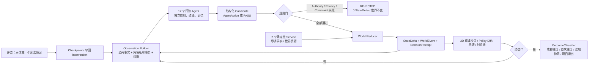
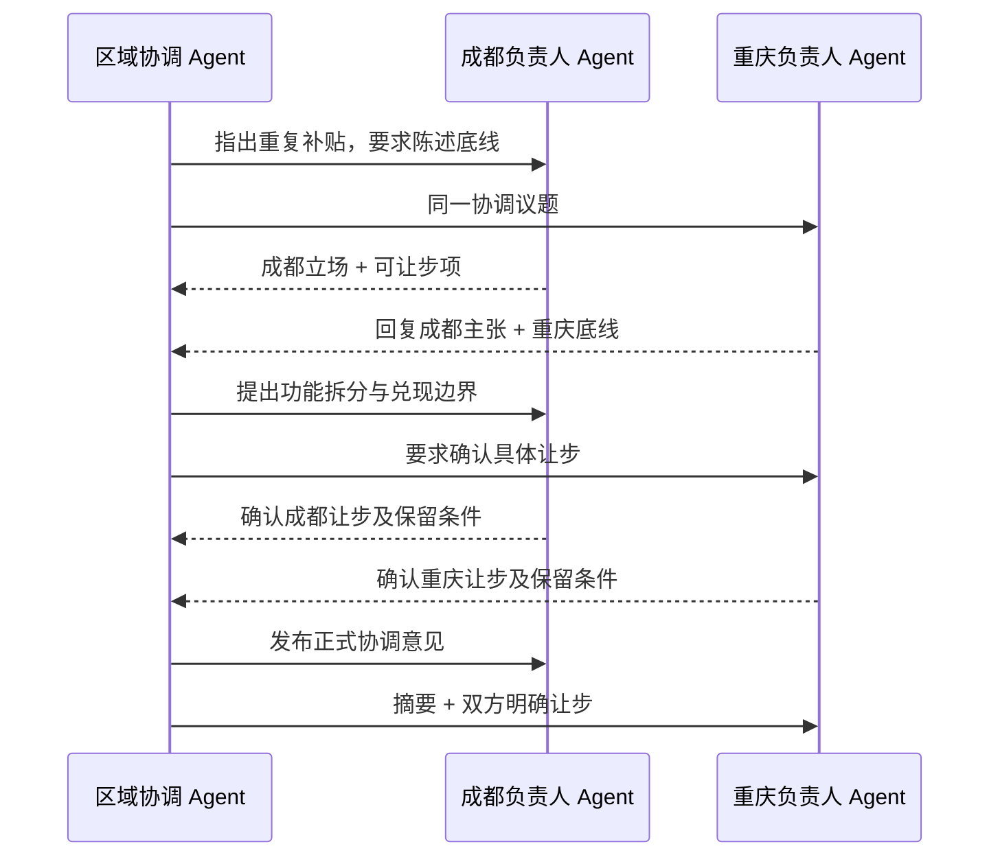
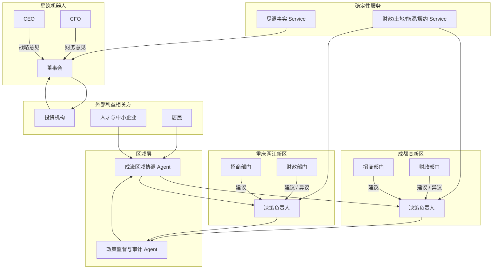

# CityScope Agent 协作与干预流程

## 主流程

这里的循环不是 14 个 Agent 在一个无边界群聊里轮流念稿。调度器先根据阶段确定有资格行动的主体，每个主体只能看到自己的 Observation，只能提交契约允许的结构化候选；代码规则决定候选能否改变世界。只有进入 `coordination_debate` 后，区域协调方与两城负责人会进入一个受限谈判线程。

## 信息边界与组织内议

- 成都招商、成都财政只能看到各自建议；成都负责人能看到成都两部门建议，但看不到重庆或企业内部意见。
- 重庆遵循同样的组织隔离规则。
- CEO 与 CFO 只能看到自己的企业意见；董事会可汇总二者，政府主体看不到企业内部意见。
- 每个 Agent 只收到自己的记忆，不能读取其他 Agent 的 memory。
- 私有事实仍由 `ownerId / audience / privateFactScopes` 决定；公开披露后才会进入更多主体的 Observation。
- 谈判消息只对 `participants` 中的主体可见；非参与 Agent 不会收到协调线程。

这些限制由 Observation Builder 执行，并由 Privacy Gate 再校验候选引用的事实。被拒候选不会产生 StateDelta。

## 成渝协调不是主持人总结

协调阶段有一条可审计的回复链：

实际协议固定的是发言资格和最少证据，不固定正文或结局：六条消息必须按合法角色顺序产生，除开场外每条必须 `replyToMessageId` 指向可见前文；最后的正式意见必须引用已完成线程、给出自然语言摘要，并列出至少两项明确让步。DeepSeek 可以自由形成具体立场，Gate 只检查权限、结构、可见性和完成条件。

## 组织结构

## 为什么结果没有被预写

仓库支持四类终局，但不在干预数据中携带 `winner`、`desiredOutcome` 或分支序号。Fork 只记录 `path / previousValue / newValue / reason`。Baseline 与 Intervention 共享：

- 同一个 Checkpoint；
- 同一阶段调度器和 eligible actor 顺序；
- 同一组 Manifest、Prompt、Gate 与 Reducer；
- 同一 OutcomeClassifier。

两条世界的差异只能从这一个 Intervention 以及它随后触发的 Agent 行动中产生。结果分类器在世界未终止时会拒绝工作。

## 前端如何证明协作合理

1. 组织树显示谁只有建议权、谁能正式签发。
2. Agent X-Ray 显示角色自己的 Observation、效用贡献、权限与红线。
3. PolicyPack Diff 显示招商建议如何被财政修改、负责人如何签发、上级如何审计。
4. 红线门显示被拒候选为 `0 StateDelta`，证明 LLM 不能直接改世界。
5. 因果时间线用 `causeId` 串起 Candidate、Gate、before/after、事件和视觉变化。
6. 协调谈判舞台按成都—协调方—重庆三列呈现真实回复、反驳和让步，而不是把七条消息拆成互不相关的气泡。
7. 结算页可切换 A/B 世界，查看完整行动实录、信息可见范围、授权事实数量、规则门结果和状态变化；复盘只总结已经发生的 Action、消息、Gate 与 StateDelta。
8. Fork Lab 显示同一检查点只改一个原因后，两条世界如何分化。

完整可展示 SVG 位于 [cityscope-agent-flow.svg](cityscope-agent-flow.svg)。
