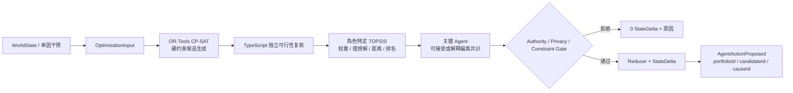

# CityScope 第二阶段：组合优化与多角色决策支持

日期：2026-08-11
状态：后端接入完成，真实模型单轮验收通过

## 一句话定位

LLM 不负责凭空算土地、预算和功能布局。CityScope 先用 OR-Tools CP-SAT 给出硬约束可行域，再用角色特定 TOPSIS 显示各方为什么偏好不同的可行方案，最后由有权限的 Agent 提出行动并经过 Gate；算法只提供证据，不指定结局。



## CP-SAT 在算什么

决策变量是五类功能各自落在成都、重庆或本期不建设：

- 总部、研发中心、智能工厂、供应链基地、培训中心。
- 总部必须与研发中心同城；供应链基地必须与智能工厂同城。
- 至少建设两个功能，且研发中心或智能工厂至少存在一个。
- 每城分别受财政、土地、厂房面积、能源、人才住房硬约束。
- 全局受企业投资计划上限约束。

求解器分别从平衡、创新、制造、财政稳健、区域韧性五个 profile 生成互异候选，并用 no-good cut 避免重复。Python 只返回赋值和求解状态；TypeScript 使用业务维度重新验算约束与效用，防止跨语言缩放误差被当成业务分数。

当前是单项目推演，因此已经为本项目预留或承诺的资源仍属于该项目的可支配容量。若未来扩展成多项目竞争，资源账本必须先增加 `ownerProjectId`，再扣除其他项目占用，不能直接把所有 reservation 都视为不可用。

## TOPSIS 在算什么

每个候选统一投影到十个 0–100 维度：创新价值、制造价值、就业、公共收益、企业价值、执行概率、区域协同、财政成本、流动性风险、资源压力。后三项是成本方向，其余是收益方向。

成都负责人、重庆负责人、区域协调、政策监督、CEO、CFO、投资机构、董事会、人才与中小企业、居民分别拥有独立权重。系统保留：

- 权重与方向；
- 向量归一化后的加权矩阵；
- 正理想解与负理想解；
- 到两个理想解的距离；
- 接近度、名次以及跨角色 Borda 共识。

“共识第一”不是命令。某个 Agent 可以选择自己的第一名，也可以偏离自己的排序或跨角色共识，但真实模型必须在 reasoning 中说明原因并引用候选 ID。安全 Stub 和 fallback 也会引用本角色第一候选，避免算法成为与行动无关的装饰。

## 前端可直接使用的证据

关键 `AgentActionProposed` / `ActionRejected` 事件的 `payload.decisionSupport` 包含：

- `portfolioId`：同一批候选的稳定标识；
- `optimizer.engine / engineVersion / status`：证明实际求解器及状态；
- `candidates`：功能布局、资源占用、十维得分、约束证据；
- `actorRanking`：当前 Agent 的完整 TOPSIS 计算；
- `consensusCandidateId`：跨角色共识，仅用于比较。

运行耗时没有进入因果事件，因为它是环境遥测，会破坏相同 seed 的回放哈希；前端可以展示求解器类型和状态，但不能把波动耗时当成世界证据。若确实需要 P95，应从独立遥测接口读取。

## 故障与降级

- 真实模型：优先调用 OR-Tools；进程失败或候选不足时使用 3^5 穷举验证器降级，并在 diagnostics 标记原因。
- 硬约束无解：返回 `INFEASIBLE + []` 给 Agent，不崩溃、不伪造方案。
- 模型输出非法：一次 Schema 修复；Gate 拒绝后再把具体原因反馈给模型修复；仍失败才使用确定性合法 fallback。
- Stub：使用同一输入、候选与 TOPSIS，保证离线演示可重复，但界面必须诚实显示 Stub / Fixture。

## 可复现实验

```bash
python3 -m venv .venv-optimization
.venv-optimization/bin/python -m pip install -r requirements-optimization.txt
npm run build
npm run decision:check
npm test
npm run demo:fixture
npm run fixtures:validate
npm run demo:live
```

2026-08-11 验收结果：

- 真实 OR-Tools 9.14：5 个互异可行候选，TypeScript 二次校验全部通过。
- 后端：9 个测试文件、47 项通过；相同 seed 回放稳定。
- DeepSeek V4 Flash：约 110 秒，27 步，26 次模型行动、1 次确定性服务、0 fallback、0 最终拒绝。
- 19 个关键行动包含 `ortools-cp-sat` 事件证据，19 个行动理由引用候选 ID。
- 真实终态为 `CONTINUING_COMMITMENTS`：两个政策包被审计指出问题，董事会进入再谈判。该结果说明可行域与多目标排序没有替 Agent 预写胜负。

## 开源复用与边界

- 直接依赖：Google OR-Tools 的 CP-SAT Python 包，固定版本见 `requirements-optimization.txt`。
- TOPSIS：本仓库按标准公式独立实现，没有复制外部评分 Agent 的代码；此前评分项目的可解释权重、分项证据思想被方法层复用。
- 用户自有 `courier-delivery-solver`：经用户明确授权，复用了 Evaluation 式验证、objective/fitness 分离、失败记录、候选去重与离线批量回归等工程方法；没有搬用骑手、任务束、接单概率或配送局部搜索变量。详见 `docs/engineering/solver-reuse.md`。
- EoH 的 E1/E2/M1/M2 仅作为离线参数搜索思路，在线 Demo 不生成或执行任意 Python 代码；若后续直接引入 LLM4AD 实现，必须保留其原许可证与署名。
- 当前数字是黑客松机制演示参数，不是成都或重庆真实政策建议，也不是现实招商预测。
